# 블로그 만들기 with 홈 서버 (1) - 홈 서버 만들기

최근 진행 중인 토이 프로젝트를 배포하기 위해서 서버가 하나 필요했습니다. 일반적으로 AWS와 EC2를 이용해서 서버 인스턴스를 만들지만, 집에 안 쓰는 노트북을 이용해서 홈 서버를 구축하는 게 경제적으로 더 효율적일 것 같더라고요. 그래서 노트북에 Ubuntu server 20.04 LTS 버전을 설치해서 홈 서버를 구축했습니다.

홈서버를 구축하기 위해서 저는 다음과 같은 단계가 필요했습니다.

- 운영 체제 준비
- 원격 연결을 위한 모듈 설치
- 홈서버 IP 고정
- 안전한 운영을 위한 보안 설정

하나씩 진행해 볼게요.

<br /><br />

## 운영체제 설치

저는 서버 운영체제로 Ubuntu 20.04 LTS 버전을 선택했습니다. 왜냐하면 AWS에서 실제로 Ubuntu를 채택하고 있고 오픈 소스라 무료이기도 하기 때문이에요. 우분투를 설치하는 것은 어렵지 않고 또 구글링을 하면 자세하면서도 쉬운 글들이 많이 있기 때문에 따로 설명하진 않을 겁니다.

[우분투 서버 설치](https://ubuntu.com/download/server)

> Trouble Shouting
> AWS에서는 22.04 LTS 버전을 기본으로 제공하고 있습니다. 이유는 모르겠지만 docker와 linux 시스템 사이의 버전 충돌이
> 있었어요. 그래서 이 글이 작성되는 시점(2022-08-08)인 지금은 20.04 LTS 버전을 채택했습니다.

<br /><br />

## 원격 연결을 위한 모듈 설치

ssh를 이용해서 원격 연결을 하기 위해서는 openssh-server라는 모듈을 설치해야 합니다.
```bash
sudo apt update
sudo apt upgrade
sudo apt install openssh-server
```
그리고 openssh-server를 설치해주면 원격 연결을 위한 모듈 설치가 끝납니다. 이제 ssh 접근이 가능합니다. 하지만, 이렇게 서버를 구축하면 다른 나라의 해커들이 접근을 시도합니다. 무작위로 ip와 포트를 입력해서 ssh 접근을 시도하는 거죠. 이를 방지하기 위해 보안에도 신경을 써야 합니다. 그전에, 일단 ssh 접속이 가능한 상태이니 ssh 연결을 먼저 진행해볼게요.

저는 MobaXterm이라는 윈도우 프로그램을 이용했습니다. Putty라는 프로그램도 많이 사용합니다.
[MobaXterm 설치](https://mobaxterm.mobatek.net/download.html) 

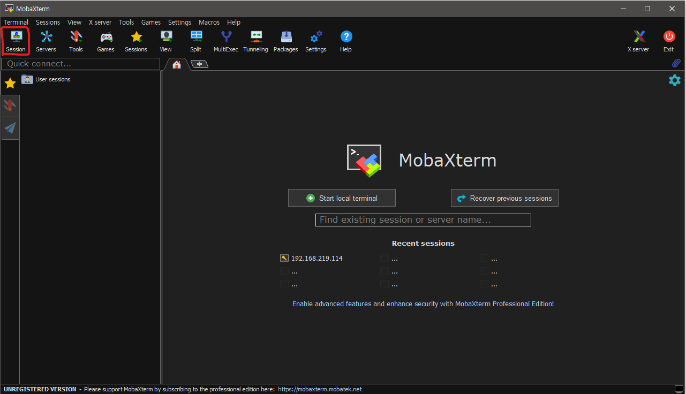

모바텀을 처음 키면 위와 같은 화면이 나타납니다. 빨간색으로 네모를 쳐둔 Session이라는 버튼을 클릭하면 서버와 ssh 연결되는 세션을 열 수 있어요.

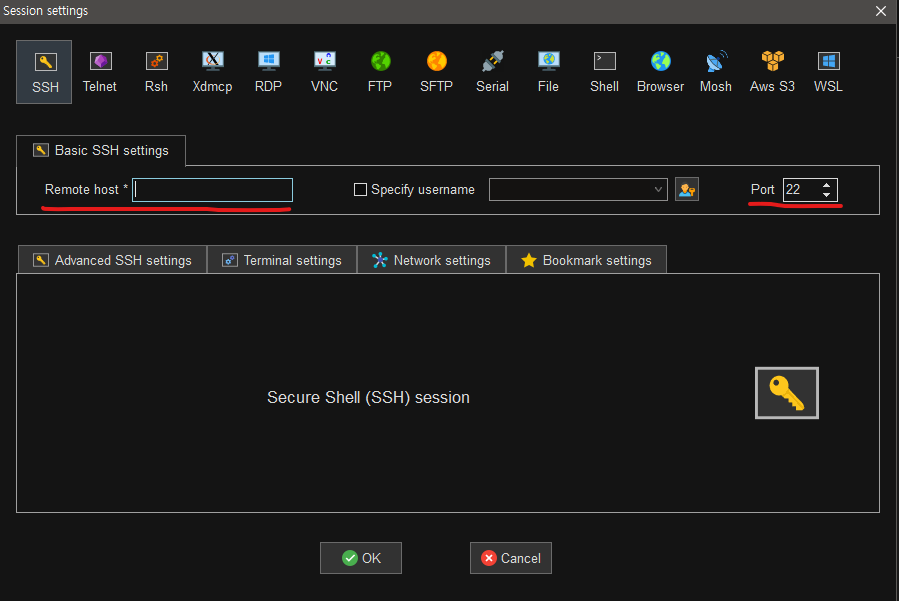

세션을 여는 창을 보면 여러 가지 방법들이 있는데, 가장 앞에 있는 SSH를 이용할 겁니다. 여기서 반드시 입력해야 하는 것들을 사진에 빨간 밑줄로 표시했습니다.

- Remote host : 원격으로 연결할 호스트(서버)의 IP 혹은 도메인 입력해야 합니다.
- Port : 접속할 Port 번호를 입력합니다. 기본값은 22번으로 ssh의 기본 Port는 22번입니다.

우선, port는 기본값을 둔 채로 IP주소만 입력할 것입니다. 이제 ip 주소를 알아내야겠죠? 저는 이에 대해 두 가지 방법을 알려 드리겠습니다. 첫 번째는 설치한 우분투 서버에서 명령어를 입력하는 방법이고 두 번째는 공유기 설정에서 확인하는 방법입니다.

> **우분투 서버에서 직접 알아내기**
>
> 설치한 우분투 서버에서 ifconfig라는 명령어를 입력하면 ip주소를 알아낼 수 있습니다만, 이를 위해서는 net-tools라는 모듈을 설치해야 합니다. AWS와 달리 이런 기본적인 것들이 설치가 안 되어 있어요. openssh-server 모듈을 설치할 때와 마찬가지로 진행하면 됩니다.
>
> ```cmake
> sudo apt install net-tools
> ```
>
> 설치가 완료되고 명령어를 입력해보겠습니다.
>
> 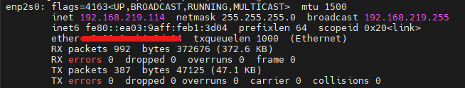
>
>  
>
> **공유기 설정에 들어가서 알아내기**
>
> 공유기는 인터넷 회사마다, 또 공유기 모델마다 상이합니다. 따라서 이에 맞게 설정 화면으로 들어가면 됩니다. 저는 U+ 를 쓰고 있기 때문에 U+ 기준으로 진행하겠습니다. 주소창에 192.168.219.1을 입력하면 공유기 설정 창으로 이동합니다.
>
> 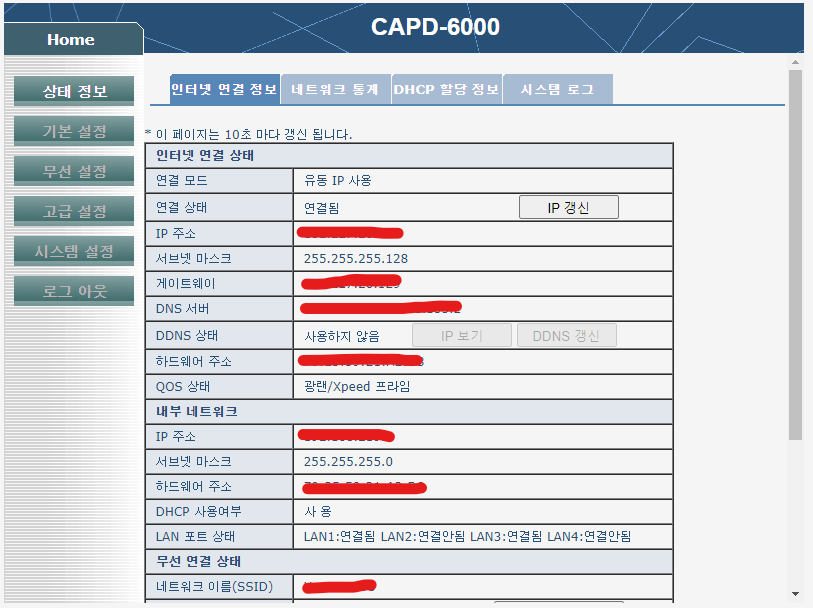
>
> 여기 나오는 IP 주소가 아닙니다. 우리는 서버가 설치된 노트북의 IP 주소가 필요해요. DHCP 할당 정보를 확인하여 해당 IP를 확인합니다.
>
> 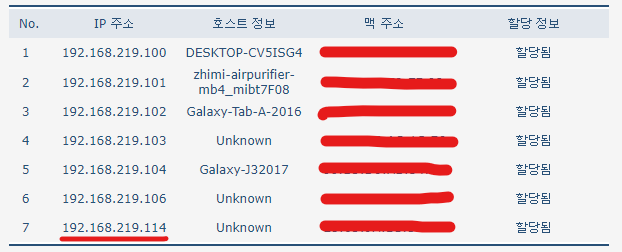
>
> 우분투에서 직접 확인한 IP와 동일한 주소가 보이시죠? 참고로 사진에 제가 가린 것처럼 **공인 IP 주소와 MAC 주소는 반드시 보안에 신경 써주세요!! 외부로 유출되서는 안됩니다.**

<br /><br />

이제 모바텀에서 ip와 포트번호를 입력하면 서버와 ssh 연결을 시도할 수 있습니다. 접근 시에 **유저 네임과 패스워드**를 요구하는데, 우분투를 설치할 당시에 설정했던 유저 네임과 패스워드를 입력해주세요

이 과정 진행 중에 모바텀에서 알림 창을 하나 띄울 겁니다. 이는 비밀번호를 저장해 두고 다음 접속부터는 비밀번호 없이 접속 가능하도록 설정할 건지 묻는 것입니다. 저는 귀찮아서 OK 했습니다.

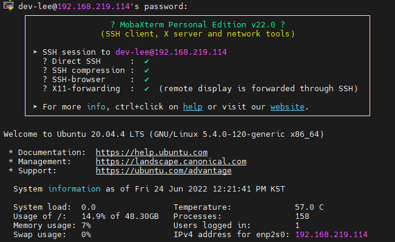

접속에 성공하면 위와 같은 화면을 보실 수 있을 겁니다. 

> 서버 노트북을 껐다가 켜면 위에서 알아냈던 IP로 ssh 연결이 가능할까요? 안됩니다. 바로 아까 설명 없이 넘어갔던 DHCP 때문인데요. DHCP에 대해서 가볍게 설명하고 이런 문제를 해결하기 위해서 고정 서버에 고정 IP를 할당해봅시다.

<br /><br />

## DHCP와 고정 내부 IP 설정

DHCP란 Dynamic Host Configuration Protocol의 약자입니다. DHCP는 바로 호스트의 IP 주소를 유동적으로 알아서 변경해주는 것을 의미해요. 그래서 컴퓨터를 껐다 켜거나 혹은 네트워크에 재접속하거나, 또 인터넷 회사의 특정 사유로 인해서 재할당 하는 경우 등 여러 가지 원인으로 인해서 내부 IP를 재할당 하는 것입니다. 원리를 설명하기엔 글이 길어지니 요점인 **IP주소가 유동적이어서 바뀔 수 있다는** 점만 짚고 넘어갈게요

### 내부 IP 고정

이것도 여러 방법이 있겠지만, 저는 서버 자체에서 하는 방법을 소개해드릴게요. 먼저 다음의 명령어를 입력해주세요

```bash
cd /etc/netplan
ls
```

netplan 디렉터리로 이동한 뒤에 해당 디렉터리의 목록을 확인해봅시다.

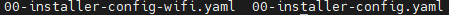

목록은 서버마다 다르며 위 사진은 제 예시일 뿐입니다. 저는 유선랜을 이용할 것이므로 두 번째 파일을 수정해서 IP를 고정할게요. 저는 리눅스 환경에서 주로 vi 편집기를 이용합니다.

```bash
sudo vi [수정하고자 하는 문서]
```

다음과 같이 수정해주세요

```bash
network:
	ethernets:
    	enp2s0:
        	addresses:
          	- 192.168.219.114/24
            gateway4: 192.168.219.1
            nameservers:
	            addresses:
	            - 8.8.8.8
	            search:
	            - 8.8.4.4
	version: 2
```

**단락(indenting)에 주의해서 작성해주세요!!**

ifconfig 결과와 함께 살펴보도록 할게요

 

- enp2s0 : 결과 화면 내용을 그대로 적어줍니다.
- addresses : 고정하고자 하는 IP 주소입니다. 꼭 ifconfig에 나온 대로 할 필요 없습니다. 100 ~ 199 사이로 정해주세요.
- 000.000.000.000/24 : IP 주소 뒤에 나오는 숫자는 서브넷 마스크를 의미합니다. 24 = 255.255.255.0
- gateway4 : 공유기 설정할 때 사용한 ip주소예요. U+의 경우 192.168.219.1입니다.

마지막으로 아래의 명령어를 입력하면 이제 어떠한 경우에서도 설정한 내부 IP로 고정됩니다. 이제 내부 네트워크에서 ssh 연결을 하기 위해서는 설정해둔 IP로 접속하면 됩니다.

```bash
sudo netplan apply
```

<br /><br />

## 외부에서 ssh 연결하기

고정 IP를 할당할 때, 제가 계속 내부 IP라고 한 것을 눈치채셨나요? 공유기를 통해서 인터넷에 접속할 때, 당연히 같은 공유기에 여러 장치들이 연결되어 돌아갈 겁니다. 이 글에서 보이는 제 예시의 경우 총 7개의 장치가 하나의 네트워크 내부에 연결되어 있죠. 그림으로 따지면 다음과 같습니다.

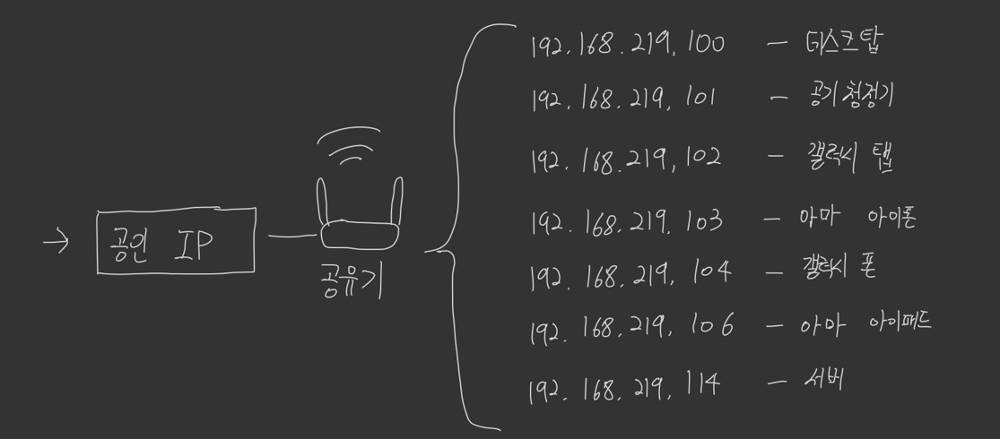

이제까지 나온 모든 IP주소들은 네트워크 내부에서 통용되는 IP 주소들입니다. 실제로 저희 집의 IP 주소는 하나예요. 바로 공인 IP 하나죠. 외부에서는 아까 고정해둔 192.68.219.114라는 IP주소로 ssh 연결을 시도할 수 없어요. 어느 공인 IP의 내부 네트워크인지 알 수 없기 때문입니다. 대한민국에 U+ 인터넷을 이용하는 모든 사람들의 집에서 어떤 공인 IP의 내부 IP인지 알 수 없는 일이죠.

따라서 외부에서 ssh 접속을 하기 위해서는 공인 IP를 이용해 접속해야 합니다. 공인 IP는 공유기 설정이나 우분투, 심지어 공인 IP를 알려주는 사이트도 존재하니, 그 방법에 대해서는 생략하겠습니다.

아까 모바텀에서 IP주소를 입력해 ssh 연결을 시도했었죠? 똑같이 하면 될까요? 아니요 그렇지 않습니다. 위의 사진을 기준으로 공인 IP 주소로 ssh 연결을 시도했을 때, 7개 중 어떤 내부 IP로 연결을 해줄지 어떻게 알 수 있을까요? 그렇습니다. 설정을 따로 해주어야 합니다. 이를 포트 포워딩이라고 합니다.

### 포트 포워딩

외부에서 특정 포트를 이용해 접근할 경우, 이에 맞는 내부 IP 주소로 연결해주는 것을 포트 포워딩이라고 합니다. 즉. 공인 IP의 특정 포트로 접근하면 내부 IP의 특정 주소로 연결하는 거죠. 

포트 포워딩 설정은 보통 공유기 설정에서 진행하며, 이 설정은 공유기의 종류, 기종에 따라 상이하니 이에 맞게 설정하시기 바랍니다. 역시 저는 U+ 기준으로 진행합니다.

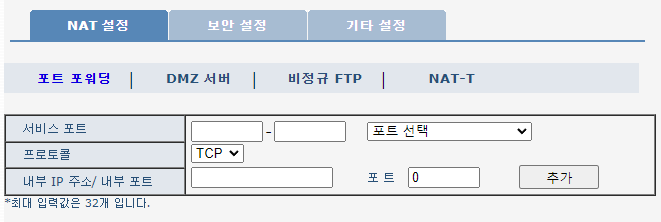

포트 포워딩 설정 창으로 이동해서 설정해봅시다. 서비스 포트는 외부에서 접속하는 포트를 의미합니다. 22라고 적는다면 이는 공인 IP 주소의 22번 포트로 접속을 시도할 경우를 의미합니다. 내부 IP 주소와 포트는 연결될 내부 주소를 의미합니다. 아까 설정해준 내부 고정 IP와 포트 번호를 입력합니다. 

지금까지 설정대로라면 포트 번호는 22번이고, 내부 고정 IP는 192.168.219.114가 되겠네요. 이제 공인 IP의 22번 포트로 접속을 시도하면, 192.168,219.114의 22번 포트로 연결되어 외부에서도 접속이 가능해집니다.

> 말 그대로 외부에서 접속하는 방법입니다. **내부에서 외부 IP를 이용해 ssh 연결을 시도하면 연결되지 않습니다.** 같은 네트워크에 접속 중인 장치에서는 내부 IP를 그렇지 않은 경우 외부 IP를 이용해주세요. 외부 IP로 테스트하는 방법 중 하나는 와이파이를 연결하지 않고 모바일에서 접속하는 것입니다.

<br /><br />

## 보안 설정

지금까지 내부, 외부에서 ssh를 이용해 서버와 연결할 수 있도록 설정했습니다. 이제 보안에 신경 써야 할 때입니다. 이렇게 누구나 접속 가능하도록 포트를 열어 놓으면 해외에서 무수한 접속 요청을 시도합니다. IP주소를 무작위로 섞어서 접속 시도를 하는 거죠. 물론 서버에 패스워드를 설정해두었지만, 접속 시도만 가능하다면 패스워드를 뚫고 해킹을 할 수도 있을 겁니다. 따라서 ssh 연결을 허용하는 외부 주소 자체를 제한하는 보안 설정까지 마치고 포스팅을 마무리하도록 하겠습니다.

### 비밀번호 설정

root 계정의 비밀번호를 설정해줍니다.

```bash
sudo passwd
```

이는 root 계정의 passwd를 설정하는 명령어입니다.

> root 계정과 ssh 연결을 할 때 설정한 user는 다릅니다!!

 

### SSH 연결 계정 제한

ssh 연결을 할 때 유저 네임과 패스워드를 입력했었죠? ssh 연결을 특정 유저만 가능하도록 설정합니다.

```bash
sudo vi /etc/ssh/sshd_config
```

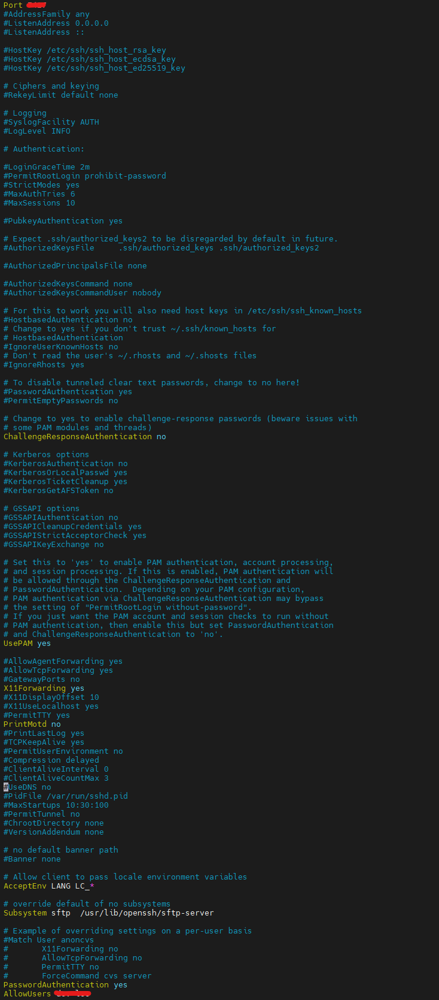

22라는 기본값을 이용하는 것도 보안에 악영향을 끼치겠죠? 저는 다른 포트로 변경해주었습니다. **만약 변경하였다면 포트 포워딩 설정 또한 변경해주어야 합니다.**

AllowUsers라는 내용은 새로 추가한 것입니다. 여기에 존재하는 유저만 ssh 연결이 가능합니다. 설정 내용을 반영하기 위해 SSH 서비스를 재시작합니다.

```bash
sudo service sshd restart
```

 

### 방화벽 설정

다음은 방화벽 설정입니다. ubuntu에는 ufw라는 툴을 이용해 방화벽 규칙을 설정할 수 있습니다만, 좀 더 디테일한 규칙을 설정하기 위해서 iptable을 직접 수정할 것입니다. 이 글에서는 특정 ip만 ssh 연결을 시도할 수 있도록 설정할 것입니다. 차례대로 따라 해 주시면 됩니다.

```bash
sudo ufw disable
```

먼저 ufw를 종료합니다.

```bash
sudo iptables -F
sudo iptables -X
sudo iptables -t nat -F
sudo iptables -t nat -X
sudo iptables -t mangle -F
sudo iptables -t mangle -X
sudo iptables -P INPUT ACCEPT
sudo iptables -P FORWARD ACCEPT
sudo iptables -P OUTPUT ACCEPT
```

기본값으로 설정되어 있던 규칙들을 모두 초기화합니다.

```bash
sudo iptables -A INPUT -m conntrack --ctstate RELATED,ESTABLISHED -j ACCEPT
```

먼저 패키지 업데이트와 같은 패킷을 허용시킵니다.

```bash
sudo iptables -A INPUT -s [허용할 IP] -p tcp -m tcp --dport [허용할 port 번호] -j ACCEPT

sudo iptables -P INPUT DROP
sudo iptables -P FORWARD DROP
sudo iptables -P OUTPUT ACCEPT
```

INPUT을 허용할 특정 IP를 규칙에 추가해줍니다. 이렇게 추가된 IP만 접속 가능해집니다. 만약에 IP주소를 틀리게 적는 실수를 하셨다면 "-A" 부분을 "-D"로 바꿔주세요. 해당 규칙만 삭제됩니다.

```bash
sudo iptables -S
```

지금까지 설정한 것들이 제대로 적용되었는지 확인해주세요. 이런 설정은 서버를 재시작하면 모두 초기화됩니다. 영구적으로 저장하기 위해서 iptables-persistent라는 모듈을 설치해 이용할게요.

```bash
sudo apt install iptables-persistent
```

설치가 완료되면 이제까지 설정을 저장하고 적용해주세요

```bash
sudo netfilter-persistent save
sudo netfilter-persistent reload
```

<br /><br />

### 침입 차단 설정

해커가 무작위로 비밀번호를 조합해서 접속을 요청하는 해킹을 방지하기 위해서 fail2ban이라는 모듈을 이용할 수 있습니다. 특정 IP 주소만 접속 가능하도록 설정해두었지만, 누군가가 IP를 속여서 접속을 시도할 수 있겠죠? 그리고 유저 네임과 비밀번호를 무작위로 조합해 칩입을 시도할 수 있습니다.

 fail2ban을 설치하고

```bash
sudo vim /etc/fail2ban/jail.local
```

설정 파일을 **생성**합니다.

```bash
[DEFAULT]
ignoreip=192.168.0.0/24
bantime=86400
maxretry=5
findtime=86400

[sshd]
enabled = true
port=22
filter=sshd
logpath=/var/log/auth.log
```

- ignoreip :

   

  설정을 적용하지 않을 IP 리스트입니다.

  - 저는 내부 접속의 경우 안전하다 판단했기에 설정했습니다. 내부 접속도 위험하다고 판단되면 이 옵션을 빼주세요.

- bantime : 칩입 시도를 감지했을 때 접속을 막을 시간 (단위 : 초)

- maxretry : 허용해 줄 횟수 (단위 : 회)

- findtime : 이상 접속의 횟수 총괄 시간 (단위 : 초)

- enable : 동작 여부

- port : 감지할 포트

- filter : 이상 동작이라고 판단할 문자열

- logpath : 필터링 할 전체 문자열 파일 경로

```bash
sudo service fail2ban restart
sudo fail2ban-client status sshd
```

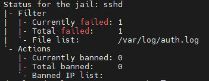

> 실수로 본인의 홈서버 비밀번호를 잘못칠 수도 있겠죠? ssh 접속을 통해서요. 이럴 경우 다음 명령어를 사용하세요.
>
> ```bash
> sudo fail2ban-client set sshd unbanip [접속을 시도한 IP]
> ```

<br /><br />

## 추가 설정

이외에도 Google OTP까지 추가로 설정 가능합니다. 저는 이것까지 필요한 단계는 아니어서 하지 않았습니다만, 민감한 정보를 다루는 경우 꼭 적용해주세요

<br /><br /><br /><br /><br /><br /><br />

**참고 자료**

https://ko.wikipedia.org/wiki/동적_호스트_구성_프로토콜